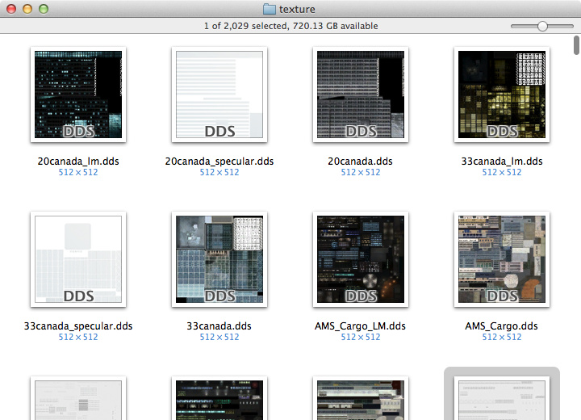
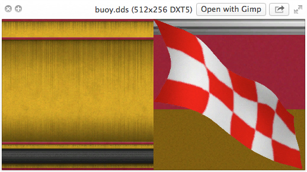
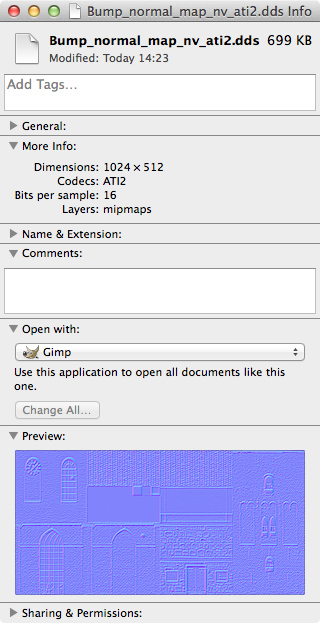
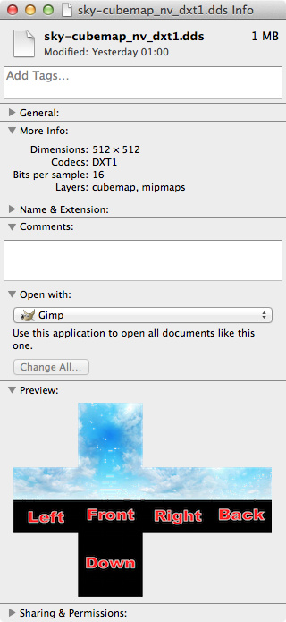

QuickLook DDS
=============

This package allows OSX Finder to display thumbnails, previews and metadata for "DirectDraw Surface" (DDS) texture files.

Installation
------------
* Download the `.pkg` file of the [latest release](https://github.com/Marginal/QLdds/releases/latest).
* Double-click on it.
* The Installer app will walk you through the installation process.
* To see thumbnails you may need to relaunch Finder (ctrl-⌥-click on the Finder icon in the Dock and choose Relaunch) or log out and back in again.
* You may experience high CPU and disk usage for a few minutes after installation while Spotlight re-indexes all of your DDS files.

Screenshots
-----------
 

 

Supported file formats
----------------------
* DirectX 8/9 DDS
* DirectX 10 DDS extensions
* Cubemaps

Supported encodings
-------------------
* DXT1 / BC1
* DXT2
* DXT3 / BC2
* DXT4
* DXT5 / BC3
* ATI1 / BC4 / LATC luminance
* ATI2 / BC5 / RGTC normal map
* Uncompressed RGB, RGBA, RGBX, Luminance & Luminance + Alpha
* Uncompressed RG normal map

Uninstall
---------
* Run the Terminal app (found in Applications → Utilities).
* Copy the following and paste into the Terminal app:

`sudo rm -rf "/Library/Application Support/QLdds" "/Library/QuickLook/QLdds.qlgenerator" "/Library/Spotlight/DDS.mdimporter"`
 
* Press Enter.
* Type your password and press Enter.

Limitations
-----------
* There's some disagreement on how normal maps are stored. This plugin assumes the DirectX10 BC5 and OpenGL [COMPRESSED_RG_RGTC2](https://www.opengl.org/registry/specs/ARB/texture_compression_rgtc.txt) convention that R=X,G=Y. Note: this is called "ATI2N (Alternate XY Swizzle)" in some tools.
* There's some disagreement on how the Blue/Z channel in a normal map is reconstructed. This plugin assumes the [Blender convention](http://wiki.blender.org/index.php/Doc:2.6/Manual/Textures/Influence/Material/Bump_and_Normal) that Blue:[0, 255] maps to Z:[0.0, 1.0]. Note: this is different from the Doom3 convention.
* Palettized and floating point encodings are not supported.
* DirectX 10/11 DXGI encodings other than those listed above are not supported - specifically BC6 / BC7 [BPTC](https://www.opengl.org/registry/specs/ARB/texture_compression_bptc.txt) encodings.
* Requires OSX 10.6 or later.

Acknowledgements
----------------
* Packaged using [Packages](http://s.sudre.free.fr/Software/Packages/about.html).
* Nyx0uf for the [idea](http://www.cocoaintheshell.com/2012/02/quicklook-images-dimensions/) of adding image dimensions to the preview title.

License
-------
Copyright © 2012-2016 Jonathan Harris.

Licensed under the [GNU Public License (GPL)](http://www.gnu.org/licenses/gpl-2.0.html) version 2 or later.
